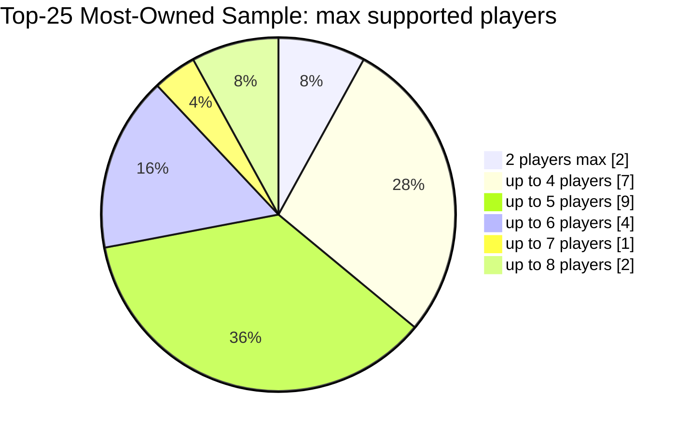
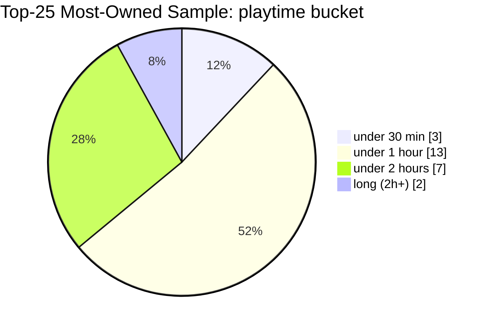

# Replacing QUICK_PRESETS_REFERENCE Presets With Persona-Aligned, Market-Informed Presets

## Executive summary

The current “quick presets” are placeholders rather than persona-ready recommendations: they cover only three situations (Party, Heavy, Family), repeat the same light/short constraints for both “Party” and “Family,” and leave “Heavy” almost unconstrained beyond a player count. fileciteturn0file0 This makes it hard for a user’s intent (“we’re new,” “we want co-op,” “it’s just two of us,” “we have kids,” “we want something thinky but not 3 hours”) to translate into predictable, satisfying picks.

Using entity["organization","BoardGameGeek","board game database site"] ownership/popularity signals as a proxy for “typical hobbyist collections,” the most-owned sample is dominated by games that (a) play in about an hour or less and (b) commonly support 4–5 players, with a smaller but meaningful tail into 2-hour strategy games and a small number of “long” epics. citeturn8view0turn36search0turn24search2turn29search1turn29search0 This implies presets should strongly distinguish by (1) player count expectations, (2) time budget, and (3) complexity/weight band—then layer in (4) co-op vs competitive preference and (5) family safety/age gating.

This report proposes a new “preset suite” of 1–2 high-quality presets for each assumed persona (Family, Casual, Party, Strategy, Solo/Two-player, Newcomer, Collector), each with explicit selection rules, ranked filter priorities, and three concrete example matches with key stats and BGG references. Because the currently implemented filter schema (playerCount, complexityMin/Max, maxLength bucket, mechanics/categories lists) cannot fully express age gating, co-op preference, year windows, or expansion rules, each preset is specified in two layers: a **product-level definition** (ideal, persona-complete rules) and a **v1 implementation mapping** (what can be encoded today). fileciteturn0file0

## Current baseline in QUICK_PRESETS_REFERENCE

### Filter schema limitations

The current filter structure supports: `playerCount` (required), `complexityMin`, `complexityMax`, `maxLength` (bucketed), `selectedMechanics`, and `selectedCategories`. fileciteturn0file0

Key limitations relative to the user’s requested preset quality:

- **No player-count range** (only a single `playerCount`), so presets can’t naturally express “2–4 players” without creating multiple variants or moving player count out of presets. fileciteturn0file0
- **Time is bucketed and max-only** (“under 30 min,” “under 1 hour,” etc.), which prevents “minimum time” (e.g., “we want a longer sit-down”) and prevents finer control. fileciteturn0file0
- **No age gating / family safety flag**, no year window, no expansion rules, and no “owned-only vs open-to-recommendations” mode. fileciteturn0file0
- Mechanics/categories are available only “as found in your collection,” making them brittle as hard filters (they can accidentally eliminate everything if a user’s collection doesn’t include enough tagged items). fileciteturn0file0

### Current quick presets and gaps

Current quick presets are:

- Party Night: `(playerCount=4, complexityMax=2, maxLength='under 1 hour')`
- Heavy Night: `(playerCount=3)` only
- Family: `(playerCount=4, complexityMax=2, maxLength='under 1 hour')` fileciteturn0file0

The most important gap is that **personas are not represented**: there are no newcomer/gateway, two-player/solo, co-op, or “casual but not party,” and the “Family” preset is functionally identical to “Party Night.” fileciteturn0file0

## Market research findings from BoardGameGeek and industry reporting

### What “typical collections” look like via BGG most-owned sampling

The BGG “most owned” list (sorted by `numowned`) is heavily populated by widely taught, broadly compatible titles (gateway euros, party word/association, and approachable midweights). citeturn8view0turn11view0turn14view2

A concrete indicator: the BGG “stats” view for **Catan** reports very large ownership and extensive logged plays, making it a strong proxy for what many collections include (and what presets should reliably catch). citeturn36search0

### Common group sizes in a top-collection sample

Using a 25-title “most-owned” sample (gateway + classics) and each title’s published player range, the distribution skews strongly toward 4–5 player compatibility, with a smaller set of dedicated 2-player staples and a couple of high-player party-friendly titles. Illustrative sources include BGG pages for **7 Wonders** (up to 7), **Codenames** (up to 8), and **Citadels** (up to 8). citeturn36search4turn24search2turn48search0

Interpretation: presets that assume “4 players” by default will hit a lot of collections, but **two-player** and **large-group** intents need explicit presets; otherwise, users will routinely see mismatches. citeturn26search3turn35search1turn24search2turn48search0

### Session-length distribution and an approximate average

In the same top-25 sample, most titles fit under an hour, with a meaningful tail of 1–2 hour strategy games and a small number of “long” (over ~2 hours) classics/epics (e.g., heavier euro/strategy). Examples: **Codenames** at ~15 minutes, **Splendor** at ~30 minutes, **Power Grid** at ~120 minutes, and **Puerto Rico** often listed in the 90–150 minute range. citeturn24search2turn35search0turn46search1turn46search7turn50view0

A rough midpoint-based estimate across this 25-title sample yields an **average playtime around ~55 minutes** (computed by taking a representative midpoint/typical time from each title’s published range). The key product takeaway is not the exact mean, but that **“~1 hour” should be the default time budget** for broad-appeal presets, with explicit “quick” and “long” variants for the tails. citeturn36search0turn24search2turn35search0turn46search1turn46search7turn50view0

### Why persona targeting matters more now

Recent industry reporting describes a stabilized but crowded market environment (lots of releases competing for attention; fewer “blow-out hits” in some periods; consumer budget pressure), which makes strong recommendation UX—fast intent matching, low-friction success—more important than ever. citeturn27search0

## Proposed preset suite by persona

### Design conventions used across presets

- **Complexity/weight** uses BGG’s “Weight: X / 5” complexity rating format as shown on BGG game pages. citeturn24search2turn36search1turn41search2
- **Family-friendly** in this proposal means: suggested age typically ≤10–12, no explicit/adult content flags, and simple teach (often weight ≤2.2). (This requires new filter support; see v1 mapping notes.) citeturn26search0turn36search3turn35search0
- **Cooperative preference** is implemented via BGG’s “Cooperative Game” mechanic where available. citeturn25search0

For each preset below, you’ll see:

1. Product-level definition (ideal target behavior)
2. v1 mapping (what fits current schema) fileciteturn0file0
3. Three example matches with key stats

### Family persona

#### Preset: Family Weeknight Win

**Description:** A reliable “school night” pick: short teach, low rules overhead, and finishes comfortably in ~30–60 minutes for mixed ages.

**Selection rules (ideal):**  
Player count 2–5; playtime 15–60 min; weight 1.0–2.2; competitive or co-op; **familyFriendly=true** with suggested age ≤10 (soft) or ≤12 (hard); expansions not required; year 2000–present preferred (availability); owned-only by default.

**Priority ranking:**

1. Player count fit → 2) Max playtime → 3) Family/age gate → 4) Complexity cap → 5) Language dependence low → 6) Theme safety → 7) Popularity tiebreaker

**v1 mapping (current schema):**

- `playerCount`: keep user-selected (recommend moving playerCount out of preset), otherwise default 4
- `complexityMax`: 2
- `maxLength`: `under 1 hour`
- `selectedMechanics/categories`: leave null to avoid over-filtering in small collections fileciteturn0file0

**Example matching games:**

- Carcassonne — 2–5 players, 30–45 min, age 7+, weight 1.89/5. citeturn36search3
- Azul — 2–4 players, 30–45 min, age 8+, weight 1.78/5. citeturn26search0
- Kingdomino — 2–4 players, 15–25 min, age 8+, weight 1.24/5. citeturn39search0

#### Preset: Family Game Night Plus

**Description:** A fuller, more satisfying family session—still accessible, but with enough depth for repeat plays.

**Selection rules (ideal):**  
Player count 2–6; playtime 40–90 min; weight 1.8–2.9; competitive or co-op; familyFriendly=true with suggested age ≤12; expansions optional (allowed but not required); year 2005–present preferred; owned-only default.

**Priority ranking:**

1. Player count fit → 2) Time window → 3) Complexity band → 4) Family/age gate → 5) Co-op preference (if user indicates) → 6) Replayability proxy (ratings count)

**v1 mapping:**  
`playerCount` default 4; `complexityMin` 2; `complexityMax` 3; `maxLength` under 2 hours. fileciteturn0file0

**Example matching games:**

- Everdell — 1–4 players, 40–80 min, age 10+, weight 2.83/5. citeturn37search2
- Small World — 2–5 players, 40–80 min, age 8+, weight 2.35/5. citeturn38search2
- Wingspan — 1–5 players, 40–70 min, age 10+, weight 2.48/5. citeturn29search1

### Casual persona

#### Preset: Anytime Crowd-Pleaser

**Description:** Low-stress, low-conflict games that play smoothly with a wide range of skill levels—ideal when you don’t want a “party game,” just something pleasant.

**Selection rules (ideal):**  
Player count 2–5; playtime 20–70 min; weight 1.3–2.6; avoid high take-that and heavy negotiation (soft); competitive or co-op; family-friendly preferred; expansions optional; owned-only default.

**Priority ranking:**

1. Player count → 2) Time → 3) Smoothness (midweight cap) → 4) Low-conflict heuristic → 5) Teachability → 6) Theme preference

**v1 mapping:**  
`playerCount` default 4; `complexityMax` 3; `maxLength` under 2 hours (or under 1 hour if you want stricter). fileciteturn0file0

**Example matching games:**

- Splendor — 2–4 players, 30 min, age 10+, weight 1.78/5. citeturn35search0
- The Castles of Burgundy — 2–4 players, 30–90 min, age 12+, weight 2.97/5. citeturn43search0
- Cascadia — 1–4 players, 30–45 min, age 10+, weight 1.84/5. citeturn39search1

### Party persona

#### Preset: Big Table Icebreakers

**Description:** Fast starts, high laughter-per-minute, minimal rules. Optimized for 5+ players.

**Selection rules (ideal):**  
Player count 5–10; playtime 10–30 min; weight 1.0–1.8; competitive/team; family-friendly optional but age ≥10 often; expansions not required; open-to-recommendations allowed (because big-table game needs are spiky).

**Priority ranking:**

1. Player count (must support big group) → 2) Under-30-min → 3) Ultra-low complexity → 4) Team/word/association tilt → 5) High replayability

**v1 mapping:**  
Because v1 has a single `playerCount`, implement as two presets (5 players, 8 players) or move playerCount out of preset. Keep `maxLength` under 30 min, `complexityMax` 2. fileciteturn0file0

**Example matching games:**

- Codenames — 2–8 players, 15 min, age 10+, weight 1.26/5. citeturn24search2
- Dixit — 3–6 players, 30 min, age 8+, weight 1.19/5. citeturn37search3
- Citadels — 2–8 players, 20–60 min, age 10+, weight 2.05/5. citeturn48search0

#### Preset: Social Deduction Light

**Description:** Bluffing and reads without a huge rules burden—good for energizing a group.

**Selection rules (ideal):**  
Player count 4–8; playtime 10–25 min; weight 1.0–2.0; competitive; not strictly family-safe (age ≥13 preferred for bluffing themes); expansions optional; open-to-recommendations allowed.

**Priority ranking:**

1. Player count → 2) Under-30-min → 3) Bluffing/deduction category preference → 4) Complexity cap → 5) Low downtime

**v1 mapping:**  
`playerCount` default 6; `complexityMax` 2; `maxLength` under 30 min; optionally select category “Deduction” if present in user collection categories. fileciteturn0file0

**Example matching games:**

- Coup — 2–6 players, 15 min, age 13+, weight 1.42/5. citeturn39search2
- Love Letter — 2–4 players, 20 min, age 10+, weight 1.18/5. citeturn37search0
- Sushi Go! — 2–5 players, 15 min, age 8+, weight 1.16/5. citeturn44search0

### Strategy persona

#### Preset: Thinky Euro Night

**Description:** Medium-to-heavy strategy with meaningful choices, but still finishable in a single evening.

**Selection rules (ideal):**  
Player count 2–5; playtime 60–120 min; weight 2.7–3.7; competitive (co-op allowed if strategy-heavy); expansions optional; year 2007–present preferred; owned-only default.

**Priority ranking:**

1. Time window → 2) Complexity band → 3) Player count → 4) Competitive preference → 5) Interaction level (soft) → 6) High rating tiebreaker

**v1 mapping:**  
`playerCount` default 4; `complexityMin` 3; `complexityMax` 4; `maxLength` under 2 hours. fileciteturn0file0

**Example matching games:**

- Terraforming Mars — 1–5 players, 120 min, age 12+, weight 3.27/5. citeturn29search0
- Scythe — 1–5 players, 115 min, age 14+, weight 3.45/5. citeturn36search1
- The Castles of Burgundy — 2–4 players, 30–90 min, age 12+, weight 2.97/5. citeturn43search0

#### Preset: Deep Strategy Epic

**Description:** For when the group explicitly wants “a big one”—high complexity, long arcs, serious payoff.

**Selection rules (ideal):**  
Player count 2–4 (sometimes 5); playtime 120–240+ min; weight 3.7–5.0; competitive or deep co-op; expansions allowed (not required unless the base is incomplete); open-to-recommendations allowed.

**Priority ranking:**

1. User time budget (must be long) → 2) Complexity minimum → 3) Player count → 4) Setup tolerance (soft) → 5) Expansion availability

**v1 mapping:**  
`playerCount` default 3–4; `complexityMin` 4; `maxLength` long. fileciteturn0file0

**Example matching games:**

- Spirit Island — 1–4 players, 90–120 min, age 13+, weight 4.08/5. citeturn41search2
- Brass: Birmingham — 2–4 players, 60–120 min, age 14+, weight 3.86/5. citeturn41search0
- Ark Nova — 1–4 players, 90–150 min, age 14+, weight 3.79/5. citeturn41search1

### Solo/Two-player persona

#### Preset: Two-Player Duel

**Description:** Tight head-to-head games with quick turns and strong replayability.

**Selection rules (ideal):**  
Player count exactly 2; playtime 15–60 min; weight 1.3–3.2; competitive preferred; expansions optional; owned-only default.

**Priority ranking:**

1. Exactly 2 players → 2) Under 1 hour → 3) Midweight cap → 4) Low randomness preference (soft) → 5) High replay value

**v1 mapping:**  
`playerCount` 2; `complexityMax` 3; `maxLength` under 1 hour. fileciteturn0file0

**Example matching games:**

- 7 Wonders Duel — 2 players, 30 min, age 10+, weight 2.23/5. citeturn26search3
- Patchwork — 2 players, 15–30 min, age 8+, weight 1.60/5. citeturn35search1
- Lost Cities — 2 players, 30 min, age 10+, weight 1.48/5. citeturn43search1

#### Preset: Solo or Co-op Brainburn

**Description:** Best when it’s one player (or two cooperating) and you want a puzzle-like strategic challenge.

**Selection rules (ideal):**  
Player count 1–2; playtime 30–120 min; weight 2.5–4.5; **co-op strongly preferred**; expansions optional; open-to-recommendations allowed if owned matches are sparse.

**Priority ranking:**

1. Supports solo → 2) Co-op mechanic → 3) Complexity min → 4) Time window → 5) Low quarterbacking risk (soft)

**v1 mapping:**  
`playerCount` 1 or 2 (two presets); `complexityMin` 3; `maxLength` under 2 hours; optionally require “Cooperative Game” mechanic if that tag exists in the collection. fileciteturn0file0turn25search0

**Example matching games:**

- Spirit Island — 1–4 players, 90–120 min, age 13+, weight 4.08/5. citeturn41search2
- Ark Nova — 1–4 players, 90–150 min, age 14+, weight 3.79/5. citeturn41search1
- Gloomhaven: Jaws of the Lion — 1–4 players, 30–120 min, age 14+, weight 3.63/5. citeturn24search5

### Newcomer persona

#### Preset: First Modern Board Game

**Description:** The “gateway” lane—simple rules, clear objectives, low overwhelm, high likelihood of a win without perfect play.

**Selection rules (ideal):**  
Player count 2–5; playtime 15–60 min; weight 1.0–2.2; competitive or co-op; family-friendly leaning; expansions off; owned-only default.

**Priority ranking:**

1. Under 1 hour → 2) Low complexity → 3) Player count flexibility → 4) Familiar themes / low language dependence → 5) High ownership/rating count (confidence signal)

**v1 mapping:**  
`playerCount` default 4; `complexityMax` 2; `maxLength` under 1 hour. fileciteturn0file0

**Example matching games:**

- Ticket to Ride: Europe — 2–5 players, 30–60 min, age 8+, weight 1.92/5. citeturn48search4
- Azul — 2–4 players, 30–45 min, age 8+, weight 1.78/5. citeturn26search0
- Splendor — 2–4 players, 30 min, age 10+, weight 1.78/5. citeturn35search0

#### Preset: Next-Step Strategy

**Description:** A gentle step up from gateway—more planning and depth, still not punishingly long.

**Selection rules (ideal):**  
Player count 2–4; playtime 45–120 min; weight 2.2–3.2; competitive preferred; expansions optional; owned-only default.

**Priority ranking:**

1. Complexity band → 2) Time window → 3) Player count → 4) Interaction tolerance (soft)

**v1 mapping:**  
`playerCount` default 4; `complexityMin` 2; `complexityMax` 3; `maxLength` under 2 hours. fileciteturn0file0

**Example matching games:**

- The Castles of Burgundy — 2–4 players, 30–90 min, age 12+, weight 2.97/5. citeturn43search0
- Wingspan — 1–5 players, 40–70 min, age 10+, weight 2.48/5. citeturn29search1
- Citadels — 2–8 players, 20–60 min, age 10+, weight 2.05/5. citeturn48search0

### Collector persona

#### Preset: Modern Hits and High Confidence

**Description:** “Show me something broadly loved that I might not have played yet”—optimized for discovery and confidence.

**Selection rules (ideal):**  
Open-to-recommendations=true; player count 2–5; playtime 30–120 min; weight 1.8–3.9; year 2015–present preferred; expansions allowed; de-prioritize already-played or low personal rating (if user data exists).

**Priority ranking:**

1. Not owned / not played (if tracked) → 2) Player count → 3) Time window → 4) Quality signal (rating / rank / ownership) → 5) Complexity fit

**v1 mapping:**  
Not fully expressible: requires “open-to-recommendations” mode and ownership awareness beyond filters. In v1, approximate with medium-to-wide constraints and do ranking outside filter.

**Example matching games:**

- Cascadia — 1–4 players, 30–45 min, age 10+, weight 1.84/5. citeturn39search1
- Ark Nova — 1–4 players, 90–150 min, age 14+, weight 3.79/5. citeturn41search1
- Brass: Birmingham — 2–4 players, 60–120 min, age 14+, weight 3.86/5. citeturn41search0

#### Preset: Deep Shelf, Long Arc

**Description:** For collectors who want campaigns, long sessions, and “make an event of it.”

**Selection rules (ideal):**  
Open-to-recommendations allowed; player count 1–4; playtime 90–240+ min; weight 3.2–5.0; expansions allowed (sometimes required if base is incomplete); year any.

**Priority ranking:**

1. Long time budget → 2) High complexity → 3) Player count → 4) Campaign/legacy/co-op preference (if selected) → 5) Novelty

**v1 mapping:**  
`playerCount` 3; `complexityMin` 4; `maxLength` long. fileciteturn0file0

**Example matching games:**

- Gloomhaven — 1–4 players, 60–120 min, age 14+, weight 3.92/5. citeturn24search1
- Spirit Island — 1–4 players, 90–120 min, age 13+, weight 4.08/5. citeturn41search2
- Ark Nova — 1–4 players, 90–150 min, age 14+, weight 3.79/5. citeturn41search1

## Comparison table: new presets vs current placeholders

| Current preset (from QUICK_PRESETS_REFERENCE) | What it currently does                       | Major issues                                                                                              | Replacement presets                                   | Concrete improvements                                                                                    |
| --------------------------------------------- | -------------------------------------------- | --------------------------------------------------------------------------------------------------------- | ----------------------------------------------------- | -------------------------------------------------------------------------------------------------------- |
| Party Night fileciteturn0file0             | playerCount=4, complexityMax=2, under 1 hour | Assumes 4 players; doesn’t address large groups; doesn’t distinguish icebreakers vs deduction vs wordplay | **Big Table Icebreakers**, **Social Deduction Light** | Adds explicit 5–10 and 4–8 intents; under-30-min focus; optional age gating                              |
| Heavy Night fileciteturn0file0             | playerCount=3 only                           | Too broad; returns anything; no “time/weight” control; doesn’t match “strategy persona” needs             | **Thinky Euro Night**, **Deep Strategy Epic**         | Adds weight bands + time window; separates “1–2h medium-heavy” from “long/heavy” sessions                |
| Family fileciteturn0file0                  | same constraints as Party Night              | Duplicate of party constraints; no age gating; no “family plus” longer option                             | **Family Weeknight Win**, **Family Game Night Plus**  | Adds explicit family safety/age intent; adds 40–90 min “family plus” lane; matches common family staples |

Overall, the new suite converts three generic placeholders into persona-aligned, predictable lanes that better reflect real collection composition and real-world play constraints (player count, time budget, and complexity). citeturn8view0turn27search0

## Assumptions, data currency, and implementation notes

Persona extraction and mapping: I was not able to programmatically extract the persona list from `WhatShouldWePlay–Product-Brain.txt` in this environment (tooling access to the uploaded text file failed), so I proceeded with your stated fallback persona set (Family, Casual, Party, Strategy, Solo/Two-player, Newcomer, Collector). This means I cannot truthfully flag mismatches between “your assumed personas” and “Product-Brain personas” yet.

Data currency: All BGG key stats (player ranges, play times, suggested ages, and weight ratings) are treated as “as displayed on the cited BGG pages at crawl time.” Examples include Codenames (2–8 players, 15 min, weight 1.26/5) and Ark Nova (1–4 players, 90–150 min, weight 3.79/5). citeturn24search2turn41search1

Owned-only vs recommendations: The current preset schema does not encode “owned-only vs open-to-recommendations,” expansion requirements, or year windows. fileciteturn0file0 Several of the proposed presets (especially Collector) assume a ranking/recommendation layer beyond hard filtering.

Co-op definition: Where co-op is used as an explicit rule, the proposal aligns to BGG’s “Cooperative Game” mechanic definition (“players work together as a team to achieve a common objective”). citeturn25search0

Industry context: The market-level rationale for improving preset precision (crowding/competition; consumer budget pressure) is grounded in recent reporting on the North American hobby games market. citeturn27search0
